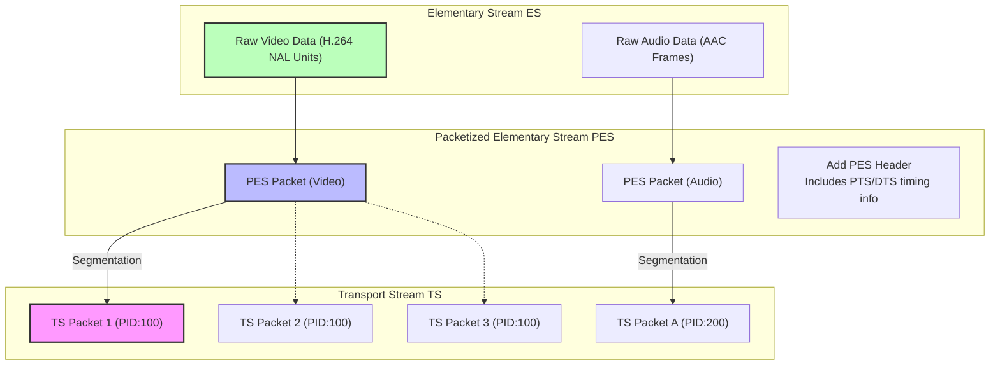
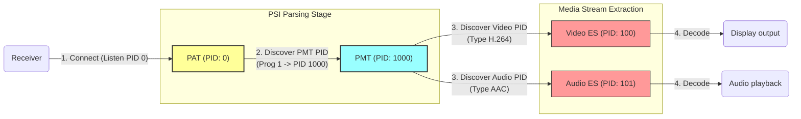
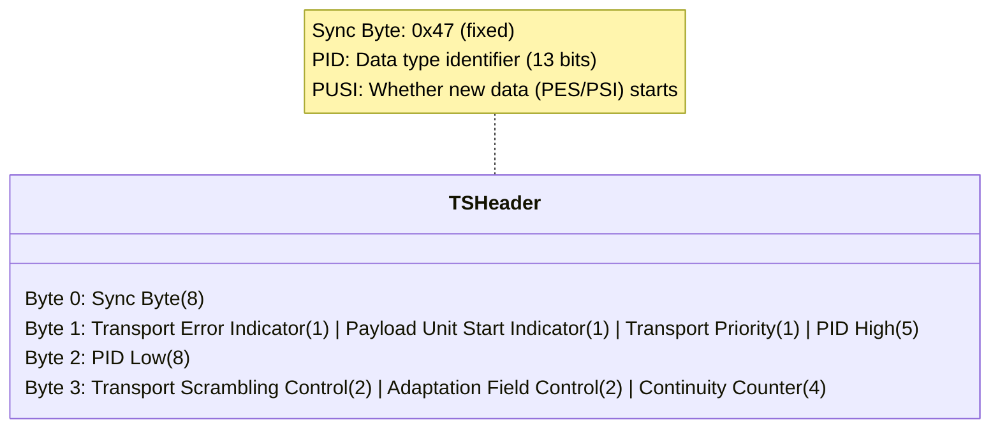
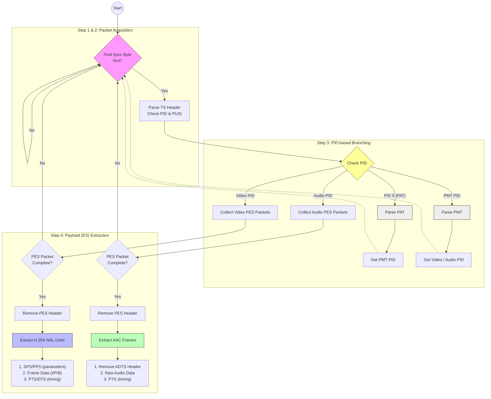

# MPEG-2 Transport Stream (TS) Structure

MPEG-2 TS is a container format used in digital broadcasting. It transmits video, audio, and data multiplexed into a single stream.

## 0. How is it Processed?



Typically, raw video (ES, Elementary Stream) is segmented into TS (Transport Stream) packets as shown above.

- PES (Packetized ES): Adds a PES header (containing playback timing like PTS) to the ES.
- TS: Splits large PES packets into 184-byte chunks (excluding header) and places them in the TS packet payload.



The process by which set-top boxes or players receive and process segmented TS packets sequentially is as follows:

- Broadcast receivers always look for **PID 0 (PAT)** first.
- They open the PAT to discover the PID of the PMT.
- They open the PMT to discover the actual video/audio PIDs.
- They collect TS packets with those PIDs, reassemble them into PES, and extract **ES (H.264/AAC)**.

While specific processing methods may differ, receivers can process live stream video by repeating this process.

## 1. TS Packet Basic Structure

### 1.1 Packet Size and Synchronization

- Packet size: 188 bytes (fixed)
  - [Header 4 bytes](#12-ts-packet-header-4-bytes)
  - Payload 184 bytes
- Sync byte: 0x47 (fixed value indicating packet start)

**Code Definition:**

```rust
const TS_PACKET_SIZE: usize = 188;
const SYNC_BYTE: u8 = 0x47;
```

### 1.2 TS Packet Header (4 bytes)



**Parsing in Code:**

```rust
let pid = ((packet[1] as u16 & 0x1F) << 8) | (packet[2] as u16);
let payload_start = (packet[1] & 0x40) != 0;  // PUSI bit (1: begin, 0: continuous)
let has_adaptation = (packet[3] & 0x20) != 0;
let has_payload = (packet[3] & 0x10) != 0;
```

**Note:**

The PUSI bit is 1 only for the first packet, and 0 thereafter.

**PID Meanings:**

- `0x0000`: PAT (Program Association Table)
- `0x0001`: CAT (Conditional Access Table)
- `0x0010 ~ 0x1FFE`: PMT, video, audio, etc.
- `0x1FFF`: Null packet

### 1.3 Adaptation Field (Optional)

A field for carrying additional information in packets.
**The presence or absence of this field affects the payload size.**

```bash
Byte 0: Adaptation Field Length
Byte 1: Flags
  - Discontinuity indicator
  - Random access indicator
  - ES priority indicator
  - PCR flag (Program Clock Reference)
  - OPCR flag
  - Splicing point flag
  - Transport private data flag
  - Adaptation field extension flag
```

**Processing in Code:**

```rust
if has_adaptation {
    let adaptation_length = packet[4] as usize;
    payload_offset += 1 + adaptation_length;
}
```

## 2. PSI (Program Specific Information)

### 2.1 PAT (Program Association Table) - PID 0

PAT indicates which programs exist and where each program's PMT is located.

**Structure:**

```bash
Pointer Field (1 byte) - when payload_start is true
Table ID (1 byte) - 0x00 for PAT
Section Length (2 bytes)
Transport Stream ID (2 bytes)
Version Number (5 bits) + Current/Next Indicator (1 bit)
Section Number (1 byte)
Last Section Number (1 byte)

[Repeat - for each program]
  Program Number (2 bytes)
  PMT PID (13 bits)

CRC32 (4 bytes)
```

**Parsing in Code:**

```rust
fn parse_pat(payload: &[u8], payload_start: bool) -> Option<u16> {
    if !payload_start || payload.len() < 13 {
        return None;
    }

    let mut offset = 0;

    // Skip pointer field
    if payload_start {
        offset += payload[0] as usize + 1;
    }

    let table_id = payload[offset];
    if table_id != 0x00 {
        return None;
    }

    // Extract PMT PID of first program
    let pmt_pid = ((payload[offset + 10] as u16 & 0x1F) << 8)
                | (payload[offset + 11] as u16);

    Some(pmt_pid)
}
```

### 2.2 PMT (Program Map Table)

PMT describes the stream composition of a specific program (which PID is video and which is audio).

**Structure:**

```bash
Pointer Field (1 byte)
Table ID (1 byte) - 0x02 for PMT
Section Length (2 bytes)
Program Number (2 bytes)
Version Number (5 bits) + Current/Next Indicator (1 bit)
Section Number (1 byte)
Last Section Number (1 byte)
PCR PID (13 bits)
Program Info Length (12 bits)
[Program Descriptors...]

[Repeat - for each stream]
  Stream Type (1 byte)
    0x1B: H.264/AVC video
    0x0F: AAC audio (ADTS)
    0x02: MPEG-2 video
    0x03: MPEG audio
  Elementary PID (13 bits)
  ES Info Length (12 bits)
  [ES Descriptors...]

CRC32 (4 bytes)
```

**Parsing in Code:**

```rust
fn parse_pmt(payload: &[u8], payload_start: bool) -> Option<(u16, u16)> {
    // ... pointer field and basic validation ...

    let section_length =
        (((payload[offset + 1] as u16 & 0x0F) << 8)
        | payload[offset + 2] as u16) as usize;

    let program_info_length =
        (((payload[offset + 10] as u16 & 0x0F) << 8)
        | payload[offset + 11] as u16) as usize;

    offset += 12 + program_info_length;

    let mut video_pid: Option<u16> = None;
    let mut audio_pid: Option<u16> = None;

    // Parse stream descriptors
    while offset + 5 <= payload.len() && offset < section_length + 3 {
        let stream_type = payload[offset];
        let elementary_pid =
            ((payload[offset + 1] as u16 & 0x1F) << 8)
            | (payload[offset + 2] as u16);

        // H.264 video
        if stream_type == 0x1B && video_pid.is_none() {
            video_pid = Some(elementary_pid);
        }
        // AAC audio
        else if stream_type == 0x0F && audio_pid.is_none() {
            audio_pid = Some(elementary_pid);
        }

        // ...
    }

    if let (Some(v), Some(a)) = (video_pid, audio_pid) {
        return Some((v, a));
    }

    None
}
```

## 3. PES (Packetized Elementary Stream)

PES is a packet that contains actual video/audio data.

### 3.1 PES Packet Header

```bash
Packet Start Code Prefix (3 bytes) - 0x000001
Stream ID (1 byte)
  0xE0-0xEF: Video
  0xC0-0xDF: Audio
PES Packet Length (2 bytes) - 0 means unspecified length
```

**Optional PES Header (most video/audio):**

```bash
Marker Bits (2 bits) - '10'
PES Scrambling Control (2 bits)
PES Priority (1 bit)
Data Alignment Indicator (1 bit)
Copyright (1 bit)
Original or Copy (1 bit)

PTS/DTS Flags (2 bits)
  00: No PTS/DTS
  10: PTS only
  11: PTS and DTS
ESCR Flag (1 bit)
ES Rate Flag (1 bit)
DSM Trick Mode Flag (1 bit)
Additional Copy Info Flag (1 bit)
PES CRC Flag (1 bit)
PES Extension Flag (1 bit)

PES Header Data Length (1 byte)

[Optional Fields - depending on flags]
  PTS (5 bytes) - Presentation Time Stamp
  DTS (5 bytes) - Decoding Time Stamp
  ...
```

### 3.2 PTS/DTS Timestamps

**PTS (Presentation Time Stamp):**

- Indicates when to display the frame
- [90kHz unit (1 second = 90000)](./90kHz_MAGIC.md)

**DTS (Decoding Time Stamp):**

- Indicates when to decode the frame
- Can differ from PTS when B-frames are present

**Encoding Format (33 bits, 5 bytes):**

```bash
PTS Encoding:
Byte 0: [0010] [PTS 32-30] [1]
Byte 1: [PTS 29-22]
Byte 2: [PTS 21-15] [1]
Byte 3: [PTS 14-7]
Byte 4: [PTS 6-0] [1]

DTS Encoding:
Byte 0: [0001] [DTS 32-30] [1]
... (same structure)
```

**Extracting in Code:**

```rust
fn extract_pes_timestamps(payload: &[u8]) -> (Option<u64>, Option<u64>) {
    if payload.len() < 9 {
        return (None, None);
    }

    // Check PES start code
    if payload[0] != 0x00 || payload[1] != 0x00 || payload[2] != 0x01 {
        return (None, None);
    }

    let pts_dts_flags = (payload[7] >> 6) & 0x03;
    let pes_header_length = payload[8] as usize;

    let mut pts = None;
    let mut dts = None;

    // PTS present (flags >= 2)
    if pts_dts_flags >= 2 && pes_header_length >= 5 {
        let pts_bytes = &payload[9..14];
        pts = Some(
            ((pts_bytes[0] as u64 & 0x0E) << 29)
                | ((pts_bytes[1] as u64) << 22)
                | ((pts_bytes[2] as u64 & 0xFE) << 14)
                | ((pts_bytes[3] as u64) << 7)
                | ((pts_bytes[4] as u64) >> 1)
        );
    }

    // DTS present (flags == 3)
    if pts_dts_flags == 3 && pes_header_length >= 10 {
        let dts_bytes = &payload[14..19];
        dts = Some(
            // ... same decoding ...
        );
    }

    (pts, dts)
}
```

### 3.3 PES Payload Extraction

```rust
fn extract_pes_payload(payload: &[u8]) -> Vec<u8> {
    if payload.len() < 9 {
        return Vec::new();
    }

    // Check PES start code
    if payload[0] != 0x00 || payload[1] != 0x00 || payload[2] != 0x01 {
        return Vec::new();
    }

    let pes_header_length = payload[8] as usize;
    let payload_start = 9 + pes_header_length;

    if payload_start >= payload.len() {
        return Vec::new();
    }

    payload[payload_start..].to_vec()
}
```

## 4. H.264/AVC Video Stream

### 4.1 NAL Unit (Network Abstraction Layer)

H.264 is composed of NAL units.

**Start Codes:**

- 3-byte: `0x00 0x00 0x01`
- 4-byte: `0x00 0x00 0x00 0x01`

**NAL Header (1 byte):**

```bash
Forbidden Zero Bit (1 bit) - always 0
NAL Ref IDC (2 bits) - reference importance
NAL Unit Type (5 bits)
  1: Non-IDR slice
  5: IDR slice (I-frame)
  6: SEI (Supplemental Enhancement Information)
  7: SPS (Sequence Parameter Set)
  8: PPS (Picture Parameter Set)
  9: Access Unit Delimiter
```

**Extracting NAL Type in Code:**

```rust
let nal_type = pes_data[nal_start] & 0x1F;

// SPS (type 7)
if nal_type == 7 && media_data.sps.is_none() {
    media_data.sps = Some(pes_data[nal_start..nal_end].to_vec());
}

// PPS (type 8)
if nal_type == 8 && media_data.pps.is_none() {
    media_data.pps = Some(pes_data[nal_start..nal_end].to_vec());
}
```

### 4.2 SPS (Sequence Parameter Set)

SPS contains global parameters of the video sequence.

**Key Information:**

- Profile and level
- Resolution (encoded in macroblock units)
- Frame cropping information
- Bit depth
- Chroma format

**Structure (bit-level):**

```bash
NAL Header (8 bits)
Profile IDC (8 bits)
Constraint Flags (8 bits)
Level IDC (8 bits)
Seq Parameter Set ID (ue(v)) - Exponential Golomb

[Profile-specific parameters...]

log2_max_frame_num_minus4 (ue(v))
pic_order_cnt_type (ue(v))
[pic_order_cnt related parameters...]

max_num_ref_frames (ue(v))
gaps_in_frame_num_value_allowed_flag (1 bit)

pic_width_in_mbs_minus1 (ue(v))
pic_height_in_map_units_minus1 (ue(v))

frame_mbs_only_flag (1 bit)
direct_8x8_inference_flag (1 bit)

frame_cropping_flag (1 bit)
[frame_crop_*_offset (ue(v)) x 4 if cropping]

...
```

**Exponential Golomb Coding:**

A method to encode values with variable length.

```bash
Value 0:   1
Value 1:   010
Value 2:   011
Value 3:   00100
Value 4:   00101
...
```

**Parsing Resolution in Code:**

```rust
fn parse_sps_resolution(sps: &[u8]) -> Option<(u16, u16)> {
    if sps.len() < 4 {
        return None;
    }

    let profile_idc = sps[1];

    // Initialize bitstream reader (skip NAL + profile + constraint + level)
    let mut bit_reader = BitReader::new(&sps[4..]);

    // Read seq_parameter_set_id
    bit_reader.read_ue()?;

    // Process profile-specific fields...
    if profile_idc == 100 || profile_idc == 110 || /* ... */ {
        let chroma_format_idc = bit_reader.read_ue()?;
        // ...
    }

    // ...skip several fields...

    // Resolution information
    let pic_width_in_mbs_minus1 = bit_reader.read_ue()?;
    let pic_height_in_map_units_minus1 = bit_reader.read_ue()?;
    let frame_mbs_only_flag = bit_reader.read_bit()?;

    // Cropping information
    let mut frame_crop_left = 0;
    let mut frame_crop_right = 0;
    let mut frame_crop_top = 0;
    let mut frame_crop_bottom = 0;

    if bit_reader.read_bit()? {  // frame_cropping_flag
        frame_crop_left = bit_reader.read_ue()?;
        frame_crop_right = bit_reader.read_ue()?;
        frame_crop_top = bit_reader.read_ue()?;
        frame_crop_bottom = bit_reader.read_ue()?;
    }

    // Calculate actual resolution
    let width = ((pic_width_in_mbs_minus1 + 1) * 16)
              - (frame_crop_left + frame_crop_right) * 2;

    let height = ((2 - if frame_mbs_only_flag { 1 } else { 0 })
                * (pic_height_in_map_units_minus1 + 1) * 16)
              - (frame_crop_top + frame_crop_bottom) * 2;

    Some((width as u16, height as u16))
}
```

### 4.3 Bitstream Reader

A bit-level reader for reading Exponential Golomb codes.

```rust
struct BitReader<'a> {
    data: &'a [u8],
    byte_offset: usize,
    bit_offset: u8,
}

impl<'a> BitReader<'a> {
    fn read_bit(&mut self) -> Option<bool> {
        if self.byte_offset >= self.data.len() {
            return None;
        }

        let bit = (self.data[self.byte_offset] >> (7 - self.bit_offset)) & 1;
        self.bit_offset += 1;

        if self.bit_offset == 8 {
            self.byte_offset += 1;
            self.bit_offset = 0;
        }

        Some(bit != 0)
    }

    // Unsigned Exponential Golomb
    fn read_ue(&mut self) -> Option<u32> {
        let mut leading_zeros = 0;

        // Count zeros until first 1
        while !self.read_bit()? {
            leading_zeros += 1;
            if leading_zeros > 31 {
                return None;
            }
        }

        if leading_zeros == 0 {
            return Some(0);
        }

        // Read remaining bits
        let mut value = 1u32;
        for _ in 0..leading_zeros {
            value = (value << 1) | if self.read_bit()? { 1 } else { 0 };
        }

        Some(value - 1)
    }

    // Signed Exponential Golomb
    fn read_se(&mut self) -> Option<i32> {
        let code_num = self.read_ue()?;
        let sign = if (code_num & 1) == 0 { -1 } else { 1 };
        Some(sign * ((code_num as i32 + 1) >> 1))
    }
}
```

## 5. AAC Audio Stream

### 5.1 ADTS (Audio Data Transport Stream)

AAC is usually transmitted with ADTS headers.

**ADTS Header (7 or 9 bytes):**

```bash
Fixed Header (4 bytes):
  Syncword (12 bits) - 0xFFF
  MPEG Version (1 bit) - 0: MPEG-4, 1: MPEG-2
  Layer (2 bits) - always 00
  Protection Absent (1 bit) - 1: no CRC
  Profile (2 bits) - 1: AAC-LC
  Sampling Frequency Index (4 bits)
  Private (1 bit)
  Channel Configuration (3 bits)
  Original/Copy (1 bit)
  Home (1 bit)

Variable Header (3 bytes):
  Copyright ID (1 bit)
  Copyright Start (1 bit)
  Frame Length (13 bits) - header + payload
  Buffer Fullness (11 bits)
  Number of Frames (2 bits) - usually 0 (1 frame)

[CRC (2 bytes) - when Protection Absent is 0]
```

**Sampling Frequency Index:**

```bash
0: 96000 Hz
1: 88200 Hz
2: 64000 Hz
3: 48000 Hz  ← common
4: 44100 Hz
5: 32000 Hz
...
```

**Extracting AAC Frames in Code:**

```rust
fn extract_aac_frames(pes_payload: &[u8]) -> (Vec<Vec<u8>>, usize) {
    let mut frames = Vec::new();
    let mut offset = 0;
    let mut last_complete_offset = 0;

    while offset + 7 < pes_payload.len() {
        // Check ADTS syncword (0xFFF)
        if pes_payload[offset] != 0xFF
            || (pes_payload[offset + 1] & 0xF0) != 0xF0 {
            offset += 1;
            continue;
        }

        // Extract frame length (13 bits)
        let frame_length = (((pes_payload[offset + 3] & 0x03) as usize) << 11)
                         | ((pes_payload[offset + 4] as usize) << 3)
                         | ((pes_payload[offset + 5] as usize) >> 5);

        if offset + frame_length > pes_payload.len() {
            break;  // Incomplete frame
        }

        // Remove ADTS header and extract raw AAC data only
        let protection_absent = (pes_payload[offset + 1] & 0x01) != 0;
        let header_size = if protection_absent { 7 } else { 9 };

        if frame_length > header_size {
            let aac_data = &pes_payload[offset + header_size..offset + frame_length];
            frames.push(aac_data.to_vec());
        }

        offset += frame_length;
        last_complete_offset = offset;
    }

    (frames, last_complete_offset)
}
```

### 5.2 AAC Frame Structure

**AAC-LC (Low Complexity):**

- 1024 samples per frame
- 48kHz sample rate → approximately 21.33ms per frame
- In 90kHz timebase: 1920 units per frame

```bash
AAC frame duration (seconds) = 1024 / 48000 = 0.021333 seconds
AAC frame duration (90kHz) = 0.021333 * 90000 = 1920
```

## 6. TS Parsing Flow

### 6.1 Overall Parsing Process



### 6.2 Main Loop in Code

```rust
pub fn parse_ts_packets(data: &[u8]) -> io::Result<MediaData> {
    let mut media_data = MediaData::new();
    let mut offset = 0;

    // 1. Find first sync byte
    while offset < data.len() && data[offset] != SYNC_BYTE {
        offset += 1;
    }

    let mut pat_pmt_parsed = false;
    let mut pmt_pid: Option<u16> = None;

    // 2. Iterate through all TS packets
    while offset + TS_PACKET_SIZE <= data.len() {
        let packet = &data[offset..offset + TS_PACKET_SIZE];

        // Verify sync byte
        if packet[0] != SYNC_BYTE {
            // Sync lost - find next sync byte
            offset += 1;
            continue;
        }

        // 3. Parse header
        let pid = ((packet[1] as u16 & 0x1F) << 8) | (packet[2] as u16);
        let payload_start = (packet[1] & 0x40) != 0;
        let has_adaptation = (packet[3] & 0x20) != 0;
        let has_payload = (packet[3] & 0x10) != 0;

        // Skip adaptation field
        let mut payload_offset = 4;
        if has_adaptation {
            let adaptation_length = packet[4] as usize;
            payload_offset += 1 + adaptation_length;
        }

        if !has_payload {
            offset += TS_PACKET_SIZE;
            continue;
        }

        let payload = &packet[payload_offset..];

        // 4. Process by PID
        if pid == 0 && !pat_pmt_parsed {
            // Parse PAT
            if let Some(pmt) = parse_pat(payload, payload_start) {
                pmt_pid = Some(pmt);
            }
        } else if Some(pid) == pmt_pid && !pat_pmt_parsed {
            // Parse PMT
            if let Some((video_pid, audio_pid)) = parse_pmt(payload, payload_start) {
                media_data.video_pid = Some(video_pid);
                media_data.audio_pid = Some(audio_pid);
                pat_pmt_parsed = true;
            }
        } else if Some(pid) == media_data.video_pid {
            // Collect video data
            // ...
        } else if Some(pid) == media_data.audio_pid {
            // Collect audio data
            // ...
        }

        offset += TS_PACKET_SIZE;
    }

    Ok(media_data)
}
```

## 7. Summary

### TS Hierarchical Structure

```bash
TS Stream
  ├─ TS Packet (188 bytes)
  │   ├─ Header (4 bytes)
  │   ├─ Adaptation Field (optional)
  │   └─ Payload
  │       └─ PSI or PES
  │
  ├─ PSI (Program Specific Information)
  │   ├─ PAT (PID 0)
  │   └─ PMT (variable PID)
  │
  └─ PES (Packetized Elementary Stream)
      ├─ PES Header (includes PTS/DTS)
      └─ ES Payload
          ├─ H.264 NAL Units (video)
          │   ├─ SPS (type 7)
          │   ├─ PPS (type 8)
          │   └─ Slice (type 1, 5)
          └─ AAC Frames (audio)
              └─ ADTS Header + Raw AAC
```

### Key Concepts

1. **Multiplexing**: Combines multiple streams (video, audio) into a single TS
2. **PID**: Identifier to distinguish each stream
3. **PSI**: Tables describing program structure
4. **PES**: Packets containing actual media data
5. **Timestamps**: Synchronization information provided via PTS/DTS
