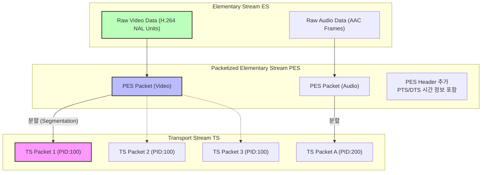
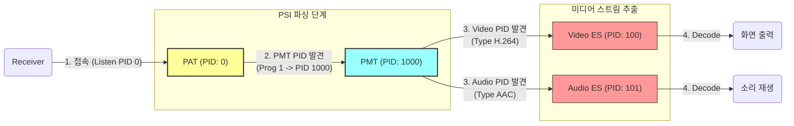
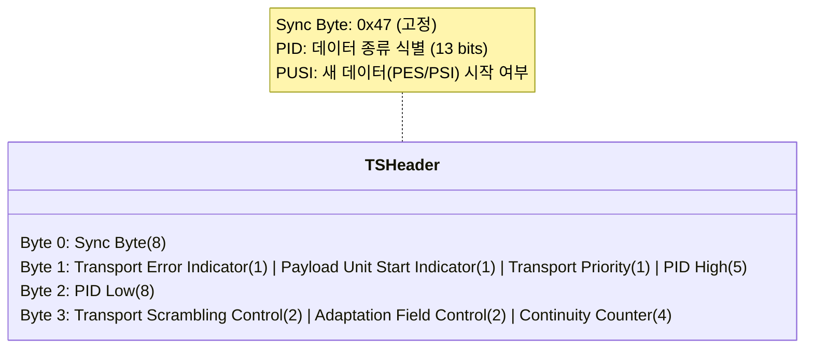
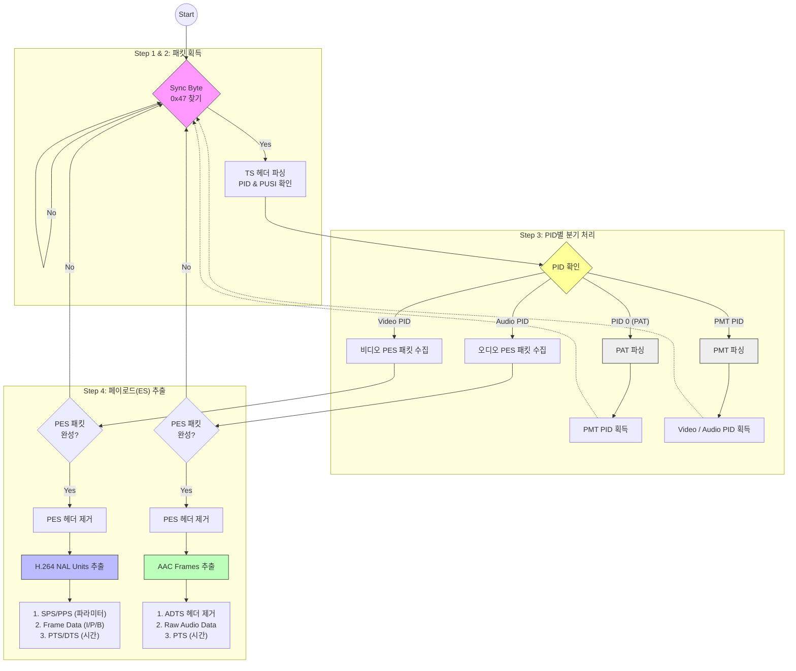

# MPEG-2 Transport Stream (TS) 구조

MPEG-2 TS는 디지털 방송에서 사용되는 컨테이너 형식입니다. 비디오, 오디오, 데이터를 하나의 스트림으로 다중화(multiplexing)하여 전송합니다.

## 0. 어떻게 처리되는가?



보통 이런식으로 원본영상(이하 ES, Elementary Stream)이 TS(Transport Stream) 패킷으로 분할됨

- PES(Packetized ES): ES 앞에 '언제 재생할지(PTS)' 등이 기록된 PES 헤더를 붙임.
- TS: 거대한 PES 패킷을 184바이트(헤더 제외) 크기의 조각으로 잘라서 TS 패킷의 payload에 담음



셋톱박스나 플레이어에서 분할된 TS 패킷을 순차적으로 받아서 처리하는 방식은 위와 같음

- 방송 수신기는 무조건 **PID 0번(PAT)**을 먼저 찾습니다.
- PAT를 열어 PMT의 PID를 알아냅니다.
- PMT를 열어 실제 비디오/오디오 PID를 알아냅니다.
- 해당 PID를 가진 TS 패킷들을 모아 PES로 조립하고, 다시 **ES(H.264/AAC)** 를 추출합니다.

구체적인 처리방식에서 차이는 발생하나, 수신기가 이 과정을 반복하면서 라이브스트림 영상을 처리할 수 있음

## 1. TS 패킷 기본 구조

### 1.1 패킷 크기와 동기화

- 패킷 크기: 188 바이트 (고정)
  - [헤더 4 바이트](#12-ts-패킷-헤더-4-바이트)
  - 페이로드 184 바이트
- sync byte: 0x47 (패킷의 시작을 나타내는 고정값)

**코드 상의 정의:**

```rust
const TS_PACKET_SIZE: usize = 188;
const SYNC_BYTE: u8 = 0x47;
```

### 1.2 TS 패킷 헤더 (4 바이트)



**코드에서 파싱:**

```rust
let pid = ((packet[1] as u16 & 0x1F) << 8) | (packet[2] as u16);
let payload_start = (packet[1] & 0x40) != 0;  // PUSI bit (1: begin, 0: continuous)
let has_adaptation = (packet[3] & 0x20) != 0;
let has_payload = (packet[3] & 0x10) != 0;
```

**특이사항:**

PUSI 비트는 첫번째만 1이고, 이후엔 0임

**PID의 의미:**

- `0x0000`: PAT (Program Association Table)
- `0x0001`: CAT (Conditional Access Table)
- `0x0010 ~ 0x1FFE`: PMT, 비디오, 오디오 등
- `0x1FFF`: Null 패킷

### 1.3 Adaptation Field (선택적)

패킷에 추가 정보를 담기 위한 필드입니다.
**이 내용의 유무에 따라 Payload의 크기가 달라짐**

```bash
Byte 0: Adaptation Field Length
Byte 1: Flags
  - Discontinuity indicator
  - Random access indicator
  - ES priority indicator
  - PCR flag (Program Clock Reference)
  - OPCR flag
  - Splicing point flag
  - Transport private data flag
  - Adaptation field extension flag
```

**코드에서 처리:**

```rust
if has_adaptation {
    let adaptation_length = packet[4] as usize;
    payload_offset += 1 + adaptation_length;
}
```

## 2. PSI (Program Specific Information)

### 2.1 PAT (Program Association Table) - PID 0

PAT는 어떤 프로그램들이 있고, 각 프로그램의 PMT가 어디 있는지 알려줍니다.

**구조:**

```bash
Pointer Field (1 byte) - payload_start가 true일 때
Table ID (1 byte) - 0x00 for PAT
Section Length (2 bytes)
Transport Stream ID (2 bytes)
Version Number (5 bits) + Current/Next Indicator (1 bit)
Section Number (1 byte)
Last Section Number (1 byte)

[반복 - 각 프로그램마다]
  Program Number (2 bytes)
  PMT PID (13 bits)

CRC32 (4 bytes)
```

**코드에서 파싱:**

```rust
fn parse_pat(payload: &[u8], payload_start: bool) -> Option<u16> {
    if !payload_start || payload.len() < 13 {
        return None;
    }

    let mut offset = 0;

    // Pointer field 건너뛰기
    if payload_start {
        offset += payload[0] as usize + 1;
    }

    let table_id = payload[offset];
    if table_id != 0x00 {
        return None;
    }

    // 첫 번째 프로그램의 PMT PID 추출
    let pmt_pid = ((payload[offset + 10] as u16 & 0x1F) << 8)
                | (payload[offset + 11] as u16);

    Some(pmt_pid)
}
```

### 2.2 PMT (Program Map Table)

PMT는 특정 프로그램의 스트림 구성을 설명합니다 (어떤 PID가 비디오이고 어떤 PID가 오디오인지).

**구조:**

```bash
Pointer Field (1 byte)
Table ID (1 byte) - 0x02 for PMT
Section Length (2 bytes)
Program Number (2 bytes)
Version Number (5 bits) + Current/Next Indicator (1 bit)
Section Number (1 byte)
Last Section Number (1 byte)
PCR PID (13 bits)
Program Info Length (12 bits)
[Program Descriptors...]

[반복 - 각 스트림마다]
  Stream Type (1 byte)
    0x1B: H.264/AVC video
    0x0F: AAC audio (ADTS)
    0x02: MPEG-2 video
    0x03: MPEG audio
  Elementary PID (13 bits)
  ES Info Length (12 bits)
  [ES Descriptors...]

CRC32 (4 bytes)
```

**코드에서 파싱:**

```rust
fn parse_pmt(payload: &[u8], payload_start: bool) -> Option<(u16, u16)> {
    // ... pointer field 및 기본 검증 ...

    let section_length =
        (((payload[offset + 1] as u16 & 0x0F) << 8)
        | payload[offset + 2] as u16) as usize;

    let program_info_length =
        (((payload[offset + 10] as u16 & 0x0F) << 8)
        | payload[offset + 11] as u16) as usize;

    offset += 12 + program_info_length;

    let mut video_pid: Option<u16> = None;
    let mut audio_pid: Option<u16> = None;

    // 스트림 디스크립터 파싱
    while offset + 5 <= payload.len() && offset < section_length + 3 {
        let stream_type = payload[offset];
        let elementary_pid =
            ((payload[offset + 1] as u16 & 0x1F) << 8)
            | (payload[offset + 2] as u16);

        // H.264 비디오
        if stream_type == 0x1B && video_pid.is_none() {
            video_pid = Some(elementary_pid);
        }
        // AAC 오디오
        else if stream_type == 0x0F && audio_pid.is_none() {
            audio_pid = Some(elementary_pid);
        }

        // ...
    }

    if let (Some(v), Some(a)) = (video_pid, audio_pid) {
        return Some((v, a));
    }

    None
}
```

## 3. PES (Packetized Elementary Stream)

PES는 실제 비디오/오디오 데이터를 담는 패킷입니다.

### 3.1 PES 패킷 헤더

```bash
Packet Start Code Prefix (3 bytes) - 0x000001
Stream ID (1 byte)
  0xE0-0xEF: Video
  0xC0-0xDF: Audio
PES Packet Length (2 bytes) - 0이면 길이 미지정
```

**선택적 PES 헤더 (대부분의 비디오/오디오):**

```bash
Marker Bits (2 bits) - '10'
PES Scrambling Control (2 bits)
PES Priority (1 bit)
Data Alignment Indicator (1 bit)
Copyright (1 bit)
Original or Copy (1 bit)

PTS/DTS Flags (2 bits)
  00: No PTS/DTS
  10: PTS only
  11: PTS and DTS
ESCR Flag (1 bit)
ES Rate Flag (1 bit)
DSM Trick Mode Flag (1 bit)
Additional Copy Info Flag (1 bit)
PES CRC Flag (1 bit)
PES Extension Flag (1 bit)

PES Header Data Length (1 byte)

[선택적 필드들 - flags에 따라]
  PTS (5 bytes) - Presentation Time Stamp
  DTS (5 bytes) - Decoding Time Stamp
  ...
```

### 3.2 PTS/DTS 타임스탬프

**PTS (Presentation Time Stamp):**

- 프레임을 언제 표시할지 나타냄 (프레임 출력 동기화)
  - [90kHz 단위 (1초 = 90000)](./90kHz_MAGIC.md)

**DTS (Decoding Time Stamp):**

- 프레임을 언제 디코딩할지 나타냄
- B-프레임이 있을 때 PTS와 다를 수 있음

**인코딩 형식 (33 bits, 5 bytes):**

```bash
PTS 인코딩:
Byte 0: [0010] [PTS 32-30] [1]
Byte 1: [PTS 29-22]
Byte 2: [PTS 21-15] [1]
Byte 3: [PTS 14-7]
Byte 4: [PTS 6-0] [1]

DTS 인코딩:
Byte 0: [0001] [DTS 32-30] [1]
... (같은 구조)
```

**코드에서 추출:**

```rust
fn extract_pes_timestamps(payload: &[u8]) -> (Option<u64>, Option<u64>) {
    if payload.len() < 9 {
        return (None, None);
    }

    // PES 시작 코드 확인
    if payload[0] != 0x00 || payload[1] != 0x00 || payload[2] != 0x01 {
        return (None, None);
    }

    let pts_dts_flags = (payload[7] >> 6) & 0x03;
    let pes_header_length = payload[8] as usize;

    let mut pts = None;
    let mut dts = None;

    // PTS 존재 (flags >= 2)
    if pts_dts_flags >= 2 && pes_header_length >= 5 {
        let pts_bytes = &payload[9..14];
        pts = Some(
            ((pts_bytes[0] as u64 & 0x0E) << 29)
                | ((pts_bytes[1] as u64) << 22)
                | ((pts_bytes[2] as u64 & 0xFE) << 14)
                | ((pts_bytes[3] as u64) << 7)
                | ((pts_bytes[4] as u64) >> 1)
        );
    }

    // DTS 존재 (flags == 3)
    if pts_dts_flags == 3 && pes_header_length >= 10 {
        let dts_bytes = &payload[14..19];
        dts = Some(
            // ... 같은 디코딩 ...
        );
    }

    (pts, dts)
}
```

### 3.3 PES 페이로드 추출

```rust
fn extract_pes_payload(payload: &[u8]) -> Vec<u8> {
    if payload.len() < 9 {
        return Vec::new();
    }

    // PES 시작 코드 확인
    if payload[0] != 0x00 || payload[1] != 0x00 || payload[2] != 0x01 {
        return Vec::new();
    }

    let pes_header_length = payload[8] as usize;
    let payload_start = 9 + pes_header_length;

    if payload_start >= payload.len() {
        return Vec::new();
    }

    payload[payload_start..].to_vec()
}
```

## 4. H.264/AVC 비디오 스트림

### 4.1 NAL Unit (Network Abstraction Layer)

H.264는 NAL 유닛으로 구성됩니다.

**시작 코드:**

- 3-byte: `0x00 0x00 0x01`
- 4-byte: `0x00 0x00 0x00 0x01`

**NAL 헤더 (1 byte):**

```bash
Forbidden Zero Bit (1 bit) - 항상 0
NAL Ref IDC (2 bits) - 참조 중요도
NAL Unit Type (5 bits)
  1: Non-IDR slice
  5: IDR slice (I-frame)
  6: SEI (Supplemental Enhancement Information)
  7: SPS (Sequence Parameter Set)
  8: PPS (Picture Parameter Set)
  9: Access Unit Delimiter
```

**코드에서 NAL 타입 추출:**

```rust
let nal_type = pes_data[nal_start] & 0x1F;

// SPS (타입 7)
if nal_type == 7 && media_data.sps.is_none() {
    media_data.sps = Some(pes_data[nal_start..nal_end].to_vec());
}

// PPS (타입 8)
if nal_type == 8 && media_data.pps.is_none() {
    media_data.pps = Some(pes_data[nal_start..nal_end].to_vec());
}
```

### 4.2 SPS (Sequence Parameter Set)

SPS는 비디오 시퀀스의 전역 파라미터를 담습니다.

**주요 정보:**

- 프로파일 및 레벨
- 해상도 (매크로블록 단위로 인코딩됨)
- 프레임 크롭핑 정보
- 비트 깊이
- 크로마 포맷

**구조 (비트 단위):**

```bash
NAL Header (8 bits)
Profile IDC (8 bits)
Constraint Flags (8 bits)
Level IDC (8 bits)
Seq Parameter Set ID (ue(v)) - Exponential Golomb

[프로파일별 파라미터...]

log2_max_frame_num_minus4 (ue(v))
pic_order_cnt_type (ue(v))
[pic_order_cnt 관련 파라미터...]

max_num_ref_frames (ue(v))
gaps_in_frame_num_value_allowed_flag (1 bit)

pic_width_in_mbs_minus1 (ue(v))
pic_height_in_map_units_minus1 (ue(v))

frame_mbs_only_flag (1 bit)
direct_8x8_inference_flag (1 bit)

frame_cropping_flag (1 bit)
[frame_crop_*_offset (ue(v)) x 4 if cropping]

...
```

**Exponential Golomb 코딩:**

값을 가변 길이로 인코딩하는 방법입니다.

```bash
값 0:   1
값 1:   010
값 2:   011
값 3:   00100
값 4:   00101
...
```

**코드에서 해상도 파싱:**

```rust
fn parse_sps_resolution(sps: &[u8]) -> Option<(u16, u16)> {
    if sps.len() < 4 {
        return None;
    }

    let profile_idc = sps[1];

    // 비트스트림 리더 초기화 (NAL + profile + constraint + level 건너뜀)
    let mut bit_reader = BitReader::new(&sps[4..]);

    // seq_parameter_set_id 읽기
    bit_reader.read_ue()?;

    // 프로파일별 필드들 처리...
    if profile_idc == 100 || profile_idc == 110 || /* ... */ {
        let chroma_format_idc = bit_reader.read_ue()?;
        // ...
    }

    // ...여러 필드 건너뛰기...

    // 해상도 정보
    let pic_width_in_mbs_minus1 = bit_reader.read_ue()?;
    let pic_height_in_map_units_minus1 = bit_reader.read_ue()?;
    let frame_mbs_only_flag = bit_reader.read_bit()?;

    // 크롭핑 정보
    let mut frame_crop_left = 0;
    let mut frame_crop_right = 0;
    let mut frame_crop_top = 0;
    let mut frame_crop_bottom = 0;

    if bit_reader.read_bit()? {  // frame_cropping_flag
        frame_crop_left = bit_reader.read_ue()?;
        frame_crop_right = bit_reader.read_ue()?;
        frame_crop_top = bit_reader.read_ue()?;
        frame_crop_bottom = bit_reader.read_ue()?;
    }

    // 실제 해상도 계산
    let width = ((pic_width_in_mbs_minus1 + 1) * 16)
              - (frame_crop_left + frame_crop_right) * 2;

    let height = ((2 - if frame_mbs_only_flag { 1 } else { 0 })
                * (pic_height_in_map_units_minus1 + 1) * 16)
              - (frame_crop_top + frame_crop_bottom) * 2;

    Some((width as u16, height as u16))
}
```

### 4.3 비트 스트림 리더

Exponential Golomb 코드를 읽기 위한 비트 단위 리더입니다.

```rust
struct BitReader<'a> {
    data: &'a [u8],
    byte_offset: usize,
    bit_offset: u8,
}

impl<'a> BitReader<'a> {
    fn read_bit(&mut self) -> Option<bool> {
        if self.byte_offset >= self.data.len() {
            return None;
        }

        let bit = (self.data[self.byte_offset] >> (7 - self.bit_offset)) & 1;
        self.bit_offset += 1;

        if self.bit_offset == 8 {
            self.byte_offset += 1;
            self.bit_offset = 0;
        }

        Some(bit != 0)
    }

    // Unsigned Exponential Golomb
    fn read_ue(&mut self) -> Option<u32> {
        let mut leading_zeros = 0;

        // 첫 1이 나올 때까지 0의 개수 세기
        while !self.read_bit()? {
            leading_zeros += 1;
            if leading_zeros > 31 {
                return None;
            }
        }

        if leading_zeros == 0 {
            return Some(0);
        }

        // 나머지 비트들 읽기
        let mut value = 1u32;
        for _ in 0..leading_zeros {
            value = (value << 1) | if self.read_bit()? { 1 } else { 0 };
        }

        Some(value - 1)
    }

    // Signed Exponential Golomb
    fn read_se(&mut self) -> Option<i32> {
        let code_num = self.read_ue()?;
        let sign = if (code_num & 1) == 0 { -1 } else { 1 };
        Some(sign * ((code_num as i32 + 1) >> 1))
    }
}
```

## 5. AAC 오디오 스트림

### 5.1 ADTS (Audio Data Transport Stream)

AAC는 보통 ADTS 헤더와 함께 전송됩니다.

**ADTS 헤더 (7 또는 9 바이트):**

```bash
고정 헤더 (4 bytes):
  Syncword (12 bits) - 0xFFF
  MPEG Version (1 bit) - 0: MPEG-4, 1: MPEG-2
  Layer (2 bits) - 항상 00
  Protection Absent (1 bit) - 1: CRC 없음
  Profile (2 bits) - 1: AAC-LC
  Sampling Frequency Index (4 bits)
  Private (1 bit)
  Channel Configuration (3 bits)
  Original/Copy (1 bit)
  Home (1 bit)

가변 헤더 (3 bytes):
  Copyright ID (1 bit)
  Copyright Start (1 bit)
  Frame Length (13 bits) - 헤더 + 페이로드
  Buffer Fullness (11 bits)
  Number of Frames (2 bits) - 보통 0 (1 프레임)

[CRC (2 bytes) - Protection Absent가 0일 때]
```

**샘플링 주파수 인덱스:**

```bash
0: 96000 Hz
1: 88200 Hz
2: 64000 Hz
3: 48000 Hz  ← 일반적
4: 44100 Hz
5: 32000 Hz
...
```

**코드에서 AAC 프레임 추출:**

```rust
fn extract_aac_frames(pes_payload: &[u8]) -> (Vec<Vec<u8>>, usize) {
    let mut frames = Vec::new();
    let mut offset = 0;
    let mut last_complete_offset = 0;

    while offset + 7 < pes_payload.len() {
        // ADTS 싱크워드 확인 (0xFFF)
        if pes_payload[offset] != 0xFF
            || (pes_payload[offset + 1] & 0xF0) != 0xF0 {
            offset += 1;
            continue;
        }

        // 프레임 길이 추출 (13 bits)
        let frame_length = (((pes_payload[offset + 3] & 0x03) as usize) << 11)
                         | ((pes_payload[offset + 4] as usize) << 3)
                         | ((pes_payload[offset + 5] as usize) >> 5);

        if offset + frame_length > pes_payload.len() {
            break;  // 불완전한 프레임
        }

        // ADTS 헤더 제거하고 raw AAC 데이터만 추출
        let protection_absent = (pes_payload[offset + 1] & 0x01) != 0;
        let header_size = if protection_absent { 7 } else { 9 };

        if frame_length > header_size {
            let aac_data = &pes_payload[offset + header_size..offset + frame_length];
            frames.push(aac_data.to_vec());
        }

        offset += frame_length;
        last_complete_offset = offset;
    }

    (frames, last_complete_offset)
}
```

### 5.2 AAC 프레임 구조

**AAC-LC (Low Complexity):**

- 1024 샘플 per 프레임
- 48kHz 샘플레이트 → 약 21.33ms per 프레임
- 90kHz 타임베이스에서: 1920 units per 프레임

```bash
AAC 프레임 duration (초) = 1024 / 48000 = 0.021333초
AAC 프레임 duration (90kHz) = 0.021333 * 90000 = 1920
```

## 6. TS 파싱 흐름

### 6.1 전체 파싱 프로세스



### 6.2 코드에서의 메인 루프

```rust
pub fn parse_ts_packets(data: &[u8]) -> io::Result<MediaData> {
    let mut media_data = MediaData::new();
    let mut offset = 0;

    // 1. 첫 동기 바이트 찾기
    while offset < data.len() && data[offset] != SYNC_BYTE {
        offset += 1;
    }

    let mut pat_pmt_parsed = false;
    let mut pmt_pid: Option<u16> = None;

    // 2. 모든 TS 패킷 순회
    while offset + TS_PACKET_SIZE <= data.len() {
        let packet = &data[offset..offset + TS_PACKET_SIZE];

        // 동기 바이트 검증
        if packet[0] != SYNC_BYTE {
            // 동기 손실 - 다음 동기 바이트 찾기
            offset += 1;
            continue;
        }

        // 3. 헤더 파싱
        let pid = ((packet[1] as u16 & 0x1F) << 8) | (packet[2] as u16);
        let payload_start = (packet[1] & 0x40) != 0;
        let has_adaptation = (packet[3] & 0x20) != 0;
        let has_payload = (packet[3] & 0x10) != 0;

        // Adaptation field 건너뛰기
        let mut payload_offset = 4;
        if has_adaptation {
            let adaptation_length = packet[4] as usize;
            payload_offset += 1 + adaptation_length;
        }

        if !has_payload {
            offset += TS_PACKET_SIZE;
            continue;
        }

        let payload = &packet[payload_offset..];

        // 4. PID별 처리
        if pid == 0 && !pat_pmt_parsed {
            // PAT 파싱
            if let Some(pmt) = parse_pat(payload, payload_start) {
                pmt_pid = Some(pmt);
            }
        } else if Some(pid) == pmt_pid && !pat_pmt_parsed {
            // PMT 파싱
            if let Some((video_pid, audio_pid)) = parse_pmt(payload, payload_start) {
                media_data.video_pid = Some(video_pid);
                media_data.audio_pid = Some(audio_pid);
                pat_pmt_parsed = true;
            }
        } else if Some(pid) == media_data.video_pid {
            // 비디오 데이터 수집
            // ...
        } else if Some(pid) == media_data.audio_pid {
            // 오디오 데이터 수집
            // ...
        }

        offset += TS_PACKET_SIZE;
    }

    Ok(media_data)
}
```

## 7. 정리

### TS의 계층 구조

```bash
TS Stream
  ├─ TS Packet (188 bytes)
  │   ├─ Header (4 bytes)
  │   ├─ Adaptation Field (optional)
  │   └─ Payload
  │       └─ PSI 또는 PES
  │
  ├─ PSI (Program Specific Information)
  │   ├─ PAT (PID 0)
  │   └─ PMT (가변 PID)
  │
  └─ PES (Packetized Elementary Stream)
      ├─ PES Header (PTS/DTS 포함)
      └─ ES Payload
          ├─ H.264 NAL Units (비디오)
          │   ├─ SPS (타입 7)
          │   ├─ PPS (타입 8)
          │   └─ Slice (타입 1, 5)
          └─ AAC Frames (오디오)
              └─ ADTS Header + Raw AAC
```

### 주요 개념

1. **다중화(Multiplexing)**: 여러 스트림(비디오, 오디오)을 하나의 TS로 합침
2. **PID**: 각 스트림을 구분하는 식별자
3. **PSI**: 프로그램 구조를 설명하는 테이블들
4. **PES**: 실제 미디어 데이터를 담는 패킷
5. **타임스탬프**: PTS/DTS로 동기화 정보 제공
